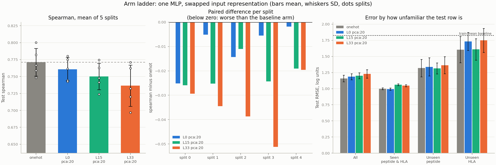

# Results — do protein language model embeddings beat a plain sequence encoding?

Entry point for reviewing the experiment. Numbers are regenerated by
`scripts/plot_ladder.py` and `scripts/compare_arms.py` from each run's
`metrics.json`; nothing here is typed by hand.

**Short answer so far: no.** One-hot residue identity matches or beats every
ESM-2 arm on every split.

---

## The experiment

One MLP block — `in → 256 → 128 → 1`, ReLU, dropout 0.2, Adam 1e-3, batch 256,
early stopping on a validation slice carved out of train — with **identical
hyperparameters for every arm**. Only the input representation changes.

| Arm | Input | Features (`pca:20`) |
|---|---|---|
| A0 | one-hot of the 43 kept positions, no PLM | 860 |
| A1 | ESM-2 layer 0 — a context-free control | 860 |
| A2 | ESM-2 layer 15 — mid-stack | 860 |
| A3 | ESM-2 layer 33 — final layer | 860 |

The 43 positions are the 9 peptide residues plus the 34 NetMHCpan contact
positions of the HLA. Target is `ln(thalf_hours + 0.1)`. Five splits, each
holding out ≥5 HLA sequences and ≥100 peptides unseen in training.

---

## Headline: budget-matched comparison (`pca:20`)



| Arm | Spearman | Paired Δ vs A0 | Splits won | PCA variance kept |
|---|---|---:|---:|---:|
| **A0 one-hot** | **0.771 ± 0.020** | — | — | — |
| A1 layer 0 | 0.761 ± 0.017 | −0.010 | **0/5** | 100.0% |
| A2 layer 15 | 0.750 ± 0.020 | −0.021 | **0/5** | 79.4% |
| A3 layer 33 | 0.736 ± 0.030 | −0.035 | **0/5** | 72.5% |

Train-mean baseline RMSE 1.825; every arm beats it by ~35%, so all of them are
learning. Full table: [`RESULTS/ladder_pca20.md`](RESULTS/ladder_pca20.md),
machine-readable: `RESULTS/ladder_pca20.csv`.

### How to read it

**The middle panel of the figure is the result.** Every arm is scored on the
same five splits, so the comparison is paired. An arm's spread across splits is
mostly split difficulty, which is shared, and it swamps the difference between
arms — the error bars overlap heavily while no PLM arm wins a single split.

**A1 vs A0 is a pipeline check, not a finding.** ESM-2 layer 0 is
`embed_scale * embed_tokens`, a per-residue lookup whose embedding matrix is
**rank exactly 20** on this alphabet (condition number 2.3). `pca:20` is
therefore *lossless* for it — A1 holds the same information as one-hot, and its
−0.010 is the expected tie, inside the ~0.025 that pooling and standardisation
alone move Spearman. That it lands there is evidence the pipeline is sound.

**A3's −0.035 is partly a budget artifact.** It retains only 72.5% of
position-vector variance at 20 components, so some of the gap is compression,
not representation. The `flatten` arms below test that directly.

---

## Capacity check (`flatten`) — in progress

`flatten` keeps all 55,040 features, giving a PLM arm **64× A0's first-layer
parameters** (14.1M vs 220k). It is therefore a *capacity* experiment, not a
representation one, and is reported separately for that reason.

A completed run of A3 layer 33 under `flatten` scored **0.767 ± 0.021** against
A0's 0.771 — a tie, at 64× the parameters, still losing 3 of 5 splits. The
remaining `flatten` arms are running; this section updates when they land.

---

## What this does and does not say

**Does:** frozen ESM-2 representations of the peptide–HLA interface carry no
predictive signal about complex half-life beyond what amino-acid identity at
those 43 positions already provides, under a matched budget.

**Does not:** say ESM-2 is uninformative in general, or that fine-tuning would
not help. Arm A4 — unfreezing the last ESM-2 block — is the untested and now
most interesting question, precisely because the frozen features do not help.

### Caveats to keep attached

1. **One seed per split.** Pooling and standardisation alone move Spearman by
   ~0.025 on identical information, and the deltas here are 0.010–0.035. The
   0/5 paired result carries the argument, not the means. Three seeds per
   (arm, split) would settle it and costs ~15 minutes per arm.
2. **`unseen_hla` is keyed on `hla_pseudoseq`, not `hla_seq`**, which
   misclassifies 382 rows per split on splits 1 and 4. The right-hand panel's
   unseen-HLA bars are affected; fix before drawing conclusions from them.
3. **A0 and A1 share a ceiling.** Both see only the 34 pseudosequence
   positions, so the two `C67S` alleles (756 rows) are indistinguishable to
   them. A2 and A3 do see the difference.
4. **Spearman is the headline, not RMSE.** 20% of the target is exactly zero
   (left-censored) and the distribution has a long tail; squared error is
   dominated by the strata where the measurement is least trustworthy.

---

## Reproducing

```bash
sbatch slurm/ladder.sbatch                       # all 7 arms, Slurm job array
python scripts/compare_arms.py RESULTS/A0_onehot RESULTS/A1_L0_pca20 \
    RESULTS/A2_L15_pca20 RESULTS/A3_L33_pca20 --csv RESULTS/ladder_pca20.csv
python scripts/plot_ladder.py  RESULTS/A0_onehot RESULTS/A1_L0_pca20 \
    RESULTS/A2_L15_pca20 RESULTS/A3_L33_pca20 --out-dir RESULTS --tag pca20
```

Design and method: [`docs/03_arm_ladder.md`](docs/03_arm_ladder.md).
Embedding extraction: [`docs/01_embedding_extraction.md`](docs/01_embedding_extraction.md).
